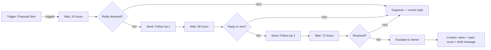

# Proposal Follow-Up Enforcer

**The average service business sends 20 proposals a month and follows up on half of them — that's $750K in pipeline dying in silence every year.**

---

## What This Prevents

A proposal sent is not a proposal enforced. Most service businesses have a closing problem that is actually a follow-up problem. The proposal went out. The prospect went quiet. Someone meant to follow up. They didn't. The deal expired in the CRM with a status that never changed from "sent."

This is not a discipline failure. It is a governance failure. When follow-up depends on a person remembering — across 10, 20, or 30 open proposals — leakage is not a risk. It is a certainty.

The math is not dramatic. It is arithmetic. A business sending 20 proposals per month at $25K average value, with 50% receiving systematic follow-up, loses $750K annually in pipeline that never closed for structural reasons. Not because the prospect said no. Because no one followed up.

**Without this:** Every proposal that doesn't close in 48 hours depends on someone's memory. Memory fails at scale.

**With this:** The moment a proposal is sent, enforcement begins. Follow-ups execute on a clock. Escalations fire with full context. The only time a human touches it is when a judgment call is required.

---

## Architecture



**How it works:**

1. **Detection** — Proposal creation event triggers the enforcement clock. The agent reads proposal value, contact, owner, and current follow-up stage. Previous enforcement state is checked — no duplicate actions fire.

2. **Intervention** — At 24 hours of silence: Follow-Up 1 sends autonomously. At 72 hours: Follow-Up 2 with a different angle. View intent is weighted — a proposal opened three times with no reply gets prioritized differently than one never opened. High-value proposals ($5K+) that go silent past 72 hours escalate immediately.

3. **Escalation** — At day 10, or when proposal value exceeds $15K, the agent packages full context — proposal value, open history, last outreach timestamp, and a pre-drafted message — and routes to the owner for one-click approval. The owner approves or adjusts. The agent sends. Nothing requires writing from scratch.

---

## Setup (5 minutes)

**Clone and run locally:**

```bash
git clone https://github.com/ronfarley0317/proposal-follow-up-enforcer.git
cd proposal-follow-up-enforcer
npm install
```

**Configure your integrations:**

```bash
cp .env.example .env
```

Edit `.env` with your credentials:

```
RUNTIME_BEARER_TOKEN=your_strong_token
RUNTIME_HMAC_SECRET=your_strong_secret
SQLITE_DB_PATH=./data/proposal-follow-up-enforcer.db
FOLLOW_UP_1_DELAY_HOURS=24
FOLLOW_UP_2_DELAY_HOURS=72
CALL_TASK_DELAY_DAYS=7
ESCALATION_VALUE_THRESHOLD=5000
HIGH_VALUE_APPROVAL_THRESHOLD=15000
```

**Initialize the database:**

```bash
npm run migrate
```

**Import the n8n workflow:**

1. Open your n8n instance
2. Click Import Workflow
3. Select `workflows/proposal-follow-up-enforcer.json`
4. Update credentials in the workflow nodes — CRM webhook, SMTP or email provider, n8n bearer token
5. Activate the workflow

**Run locally:**

```bash
npm run dev
```

Verify the service is live:

```bash
curl http://localhost:8080/health
curl http://localhost:8080/ready
```

---

## Revenue Impact

- **$375K–$750K** in annual pipeline recovered (conservative: 25–50% of silenced proposals)
- **100%** of proposals receive systematic follow-up — not dependent on rep memory
- **10-day** maximum silence before human escalation fires with full context
- Payback period: 2–6 weeks at typical proposal volumes

**The math:**

```
20 proposals/month
× 50% not receiving systematic follow-up
× $25,000 average proposal value
× 25% lift from enforcement
× 12 months
= $750,000 annual leakage prevented
```

Adjust the inputs for your business. The formula holds.

---

## Decision Engine

The enforcer doesn't send indiscriminately. Each evaluation runs a deterministic decision against the current proposal state:

| Condition | Action |
|-----------|--------|
| Proposal won, lost, or expired | Suppress — no action |
| Reply received in last 72 hours | Suppress — recent reply detected |
| Manual pause active | Suppress — until pause expires |
| High-value ($15K+) at any stage | Route to human review |
| High-value ($5K+) silent 72h+ | Escalate to owner |
| 24h silence, no prior follow-up | Queue Follow-Up 1 |
| 72h silence, follow-up 1 sent | Queue Follow-Up 2 |
| Proposal viewed, no reply | Prioritize — view intent detected |
| Expiry within 2 days | Queue urgency follow-up |
| 7+ days unresolved | Queue call task to owner |

Every decision is logged with confidence score, reason codes, and enforcement event. Full audit trail — no black box.

---

## Enforcement Agents Collection

This is part of the **Revenue Enforcement Framework** — open-source autonomous agents that make revenue leakage structurally impossible.

| Agent | Status | What It Enforces |
|-------|--------|-----------------|
| [Enforcement Live Dashboard](https://github.com/ronfarley0317/enforcement-live-dashboard) | ✅ Live | Watch enforcement agents operate in real time |
| [Invoice Payment Enforcer]([https://github.com/ronfarley0317/invoice-enforcer](https://github.com/ronfarley0317/invoice-enforcer)) | ✅ Live  | No invoice sits unpaid beyond terms |
| [Proposal Follow-Up Enforcer](https://github.com/ronfarley0317/proposal-follow-up-enforcer) | ✅ Live | No proposal dies in silence |
| [Scope Creep Detector](https://github.com/ronfarley0317/scope-creep-detector) | 🔧 In Progress | No work without compensation agreement |
| [Revenue Leakage Counter](https://github.com/ronfarley0317/revenue-leakage-counter) | 🔧 In Progress | See how fast your business leaks revenue |

---

## Tech Stack

- **n8n** — Workflow automation and enforcement orchestration
- **Claude Code** — Follow-up message generation, view intent analysis, escalation drafting
- **Fastify + TypeScript** — Decision runtime with HMAC-authenticated API
- **SQLite** — Idempotent execution storage and proposal state persistence
- **Zod** — Contract validation on every inbound payload

---

## The Law

> *"Any revenue that depends on human memory, discipline, or follow-up will leak at scale."*

This agent makes forgotten proposal follow-up structurally impossible.

---

## License

MIT

---

**Built by [Physis Advisory](https://github.com/ronfarley0317) — Revenue Integrity Engineering**

*We don't help you make more money. We make it impossible to lose money you already earned.*
